[TOC]

# Module Introduction

## What is Computer Vision?

- Making computers ‘see’ like humans
- Ways to **capturing**, **store** and **transmit** visual data
- Ways to **process** and **analyse** visual info, and how to **interpret** the results

### Applications of Computer Vision

Computer vision has a wide range of applications, like:

- Biometrics (fingerprints, faces, signatures, etc.)
- CCTV and traffic monitoring
- Object detection
- Face detection
- Facial expression recognition
- Activity recognition from video (e.g. walking, playing football, …)
- Medical imaging
- Aerial image analysis

## Image Basics & Image Sources

- A digital image is just a way of representing light information
- Images can be **real** (a real-life scene captured with a camera) or **synthetic** (generated with software)
- Most images we’re familiar with use **visible light** information, but other parts of the light spectrum can be used for other purposes

## Mathematical Image Representation

### Representing Images as Functions

- An image can be represented as a function, $f(x, y)$
- $(x, y)$ represents specific co-ordinates in the image
- $f$ returns the **amplitude** at $(x,y)$, i.e. the light intensity at that point
- Amplitude values can be:
  - grayscale (usually $0,\ 1,\ 2,\ \dots\ 255$)
  - RGB colour (3 values in range $0 - 255$)
  - black and white (either $0$ or $1$)
- $x$, $y$ and $f$ are always **finite** and **discrete**, i.e. whole integers with a fixed range

## Image Resolution

### Spacial Resolution

- Usually just ‘resolution’
- The smallest discernible detail in an image
- Measured in dots per inch/pixels per inch (dpi/ppi)
- Images with higher spacial resolution look clearer

### Bit-Depth: Intensity Resolution

- The smallest discernible change in intensity value
- Each pixel has a number of bits associated with it called the **bit-depth, measured in bpp** (bits per pixel)
- Grayscale images typically have a bit-depth of 8 (for values $0 - 255$), and colour images have a bit depth of 24 (i.e. 8 bits for each RGB channel)

## Image Storage

- An image can be stored as a matrix with $N$ rows and $M$ columns
- Each entry of the matrix is one pixel of the image
- So the storage space for an image in this format is $N\times M\times k$, where $k$ is the bit-depth
- However, images are typically compressed to reduce the amount of storage required

## Image Resampling/Interpolation

- **Interpolation** is using known values to estimate unknown values
- So **image interpolation** = increasing/decreasing number of pixels in an image by guessing/calculating the new values

### Applications of Image Interpolation

- Improved ‘zoom’ on digital cameras,
- Upscaling images (e.g. HD $\to$ 4K for TV)
- Image rotation/skewing

### Interpolation Methods

- **Nearest neighbour interpolation** simply copies the value of the nearest pixel, resulting in a sharper looking image
- **Bilinear interpolation** uses the average of pixel neighbours based on their distance, giving a smoother image

## Pixel relationships

### Pixel Neighbourhoods

- A pixel's 'neighbourhood' refers to the pixels around it
- Used for analysing regions, edges, etc.
- There are different types of neighbourhoods:
  - **4-neighbours** ($N_4$): direct top/bottom/left/right

$$
\begin{aligned}
N_4(p) \; = \;\{(x-1, y),\:(x+1, y),\\(x,y-1),\:(x, y+1)\}
\end{aligned}\tag*{}
$$

  - **Diagonal neighbours** ($N_D$): the top-left, top-right, bottom-left, bottom-right pixel neighbours

$$
\begin{aligned}
N_D(p) \;= \;\{(x-1, y-1),\:(x-1, y+1),\\(x+1, y-1),\:(x+1, y+1)\}
\end{aligned}\tag*{}
$$

  - **8-neighbours** ($N_8$): all 8 adjacent pixels, from both 4-neighbours **and** diagonal neighbours

### Paths and Connectivity

- $p$ and $q$ are **connected** if and only if a path exists connecting them
- If $p = q$ it is a **closed path**
- A **path** between $p$ and $q$ is a sequence of connected pixels linking them together

### Defining Pixel Adjacency

- Let $V$ be the set of intensity values that are included for adjacency – e.g. between $200\to 255$ 
- Let $p$ and $q$ be two pixels
- **4-adjacency**: $p$ and $q$ are 4-adjacement if they are in $V$ and 4-neighbours with each other
- **8-adjacency**: $p$ and $q$ are 8-adjacent if they are in $V$ and 8-neighbours with each other
- **M-adjacency (mixed adjacency)**: $p$ and $q$ are m-adjacent if $q$ is 4-neighbours with $p$, **or** diagonal neighbours with $p$ with no shared 4-adjacent pixels
- M-adjacency is sometimes used to eliminate ambiguities when deciding what counts as a 'neighbour', especially for pathfinding

### Image regions

- For every pixel $p$ in a set of pixels $S$, the set of pixels connected to $p$ forms a **connected component** of $S$ 
- Connected components can be used to define **regions** of an image
- Two image regions $R_1$ and $R_2$ are adjacent if some pixel from $R_1$ is adjacent to a pixel in $R_2$

### Boundaries

- The **boundary** of a region $R$ is the set of pixels in $R$ with one or more neighbours **not** in $R$
- i.e. the outline of the region

### Distances

- There are a few different ways to measure the distance between two pixels in an image
- Can define a distance function $D$ with the following rules:
  1. $D(p,q) > 0$ unless $p=q$
  2. if $p = q$, then $D(p,q)=0$
  3. $D(p, q) = D(q, p)$
  4. $D(p,z) \leq D(p,q) + D(q,z)$ for any pixels $p, q, z$ 

### Example Distance Functi

- **Euclidean distance** ($D_e$) uses Pythagorean theorem:

$$
D_e(p,q) = \sqrt{(x-2)^2 + (y-t)^2}\tag*{}
$$

- **City-block distance** ($D_4$) is the sum of the horizontal and vertical distances:

$$
D_4(p,q) = |x-s| + |y-t|\tag*{}
$$

- **Chessboard distance** ($D_8$) is the maximum of the horizontal and vertical distances:

  - $D_8(p, q) = max(|x - s|, |y-t|)$

## Image Operations

### Image Arithmetic

- Images are often represented with matrices, so we can perform matrix and vector operations on them
- Can also apply addition, subtraction, multiplication and division to each pixel
- The **array product** (written as **.***) comes from multiplying each value from array 1 by the corresponding value in array 2
- Array addition, subtraction and division work in the same way

### Noise reduction

- We can reduce noise by taking the average of multiple images of the same scene

$$
\displaystyle \bar g (x,y) = \frac{1}{K} \sum ^{K} _{i=1} g_i (x,y)\tag*{}
$$

### Digital Subtraction Angiography

- Used to highlight blood vessels in an image
- Take two images of the same scene, one before ($h$) and one after ($f$) injecting a contrasting agent
- $f(x,y) - h(x,y)$ will get an image highlighting just the contrasting agent

### Frame Differencing

- We can subtract each frame from the previous one to highlight the difference between them

# Image Processing

## Challenges of Computer Vision

Some common challenges faced in computer vision are:

- We have little knowledge of how humans process images, yet we are trying to replicate it with computers
- Images are degredaded by noise, blur, occlusions, etc. which makes analysis difficult
- There’s also an inherent loss of information when going from 3D to 2D, and cameras can only capture a limited field of view of the scene
- Image files are quite large and so difficult to process

## Spatial Domain vs. Transform Domain

- Image processing can be done in two ways: in the **spatial domain**, or the **transform domain**
- This lecture focuses on spatial domain processing, but it is important to know the difference

### Spatial Domain Processing

- The ‘spatial domain’ refers to images the way we normally think of them, represented as a grid of pixels
- **Spatial domain processing** involves directly processing the pixel values of the image
- This is the most common form of image processing

### Transform Domain Processing

- On the other hand, the 'transform domain' refers to any alternative representation of the image, such as the frequency domain (covered in Lecture 9)
- **Transform domain processing** involves transforming the image into an entirely different representation for processing
- The image can then be transformed back to the spatial domain if needed

## Image Processing Notation

Some common notation used in image processing:
  - $f(x,y)$ = input image
  - $N(x,y)$ = the neighbourhood of point $(x,y)$ 
  - $T()$ = an operator on $f()$, defined over $N(x,y)$
  - $g(x, y)$ = output image = $T(f(x, y), N(x, y))$

## Intensity Transformations

- A simple form of image processing using spatial domain processing
- Location independent, i.e. applied to each pixel independently and regardless of location
- Can be used to change brightness, contrast, etc.
- Intensity transformations take the form $s = T(r)$, where $r$ is the input pixel value and $s$ is the output pixel value
- e.g. $T(r) = cr$ where $c$ is a constant will alter the brightness of the image
- e.g. $T(r) = max - r$ will invert the image ($\to$ image negative)

### Gamma Transformations

- Linear brightness transformations are not always suitable
- Can lead to oversaturation and loss of detail
- Gamma transformations are used to alter the contrast of an image
- The gamma transformation is defined as $T(r) = cr^\gamma$, where $c$ and $\gamma$ are constants
- $\gamma$ is the **gamma value** and controls the shape of the brightness curve

## Image Histograms

- For a single-channel image, the **histogram** is a graph of the number of pixels at each intensity value

### Histogram Analysis

The histogram can be analysed for basic information about the image:

- **Brightness**: if the histogram is skewed to the left, the image is dark, and if it is skewed to the right, the image is bright
- **Contrast**: a narrow histogram means low contrast, and a wide histogram means high contrast

- Histogram stretching can be used to increase the contrast of an image, by specifying new min/max intensity values

### Histogram Equalisation

- Contrast stretching does not always give ideal results, as the histogram can still be skewed
- Histogram equalisation is a more advanced technique that redistributes the intensity values to get a more ‘flat’ looking histogram

$$
\begin{matrix}
\text{Hist. equalisation:}\ \ T(r) = (L-1)\times CDF(r)\\\\
\text{where } L = \text{num. of intensity levels}\\
\text{and } CDF(r) = \text{cumulative histogram function}
\end{matrix}
$$

### Histogram Matching

- Transform a given image to match a target histogram
- Useful for matching images from different sources
- Steps:
  1. Calculate $CDF _1$ from source image and $CDF_2$ from target image
  2. For each pixel's grey-level $G_1$ from source image, find the grey-level $G_2$ in target image where $CDF_1(G_1) = CDF(G_2)$
  3. We now have a mapping for each grey-level of source image to target image – apply this mapping to the source image and we're done

## Local Image Processing

  - The functions so far have applied transformations to the whole image (this is called **global processing**)
  - Processing can also be conducted on smaller parts of image, i.e. **local processing**

### Basic Steps for Local Image Processing

1. Define a neighbourhood to use, like a $5\times 5$ square
2. Apply a function (e.g. histogram equalisation) to the pixels in the given neighbourhood
3. Repeat for each pixel in the image, moving the neighbourhood's centre from pixel to pixel

### Averaging Filters

- **Averaging filters** are a simple form of local processing, used to blur images
- Average the pixel values in a neighbourhood to get a new value for the central pixel
- Larger kernel size $\to$ more blurred
- Can also use a **weighted average filter**: assign different weights to each pixel, typically prioritising the centre
- **Gaussian blur** is an example of a weighted average filter
- **Median filters** replace the pixel's value with the median of values in the kernel, which is better for noise reduction

### Convolutions & Spatial Filters

- **Convolutions** are another type of local processing
- Spatial filters use **kernels** (aka **masks** or **filters**)
- The kernel is a small matrix of values
- The kernel is moved across image and multiplied with the corresponding pixel values to get a new value for the central pixel
- Can be used for:
    - blurring,
    - sharpening,
    - edge detection,
    - removing noise,
    - etc.

## Image Derivatives

- We can take the derivative of an image along one dimension, e.g. the y axis:

- The **1st derivative**, $f’(x)$ of the image shows the changes in intensity, and any gradual brightness transitions
  - Common filters using the 1st derivative are the **gradient** and **Sobel** filters
- The **2nd derivative**, $f''(x)$ shows any sharp transitions – $f''(x)$ will cross the x-axis at each edge
  - A common filter using the 2nd derivative is the **Laplacian** filter for edge detection and sharpening

All of which can be used to highlight the edges in an image

## Unsharp Masking

- **Unsharp masking** is another way to sharpen images
- Steps:
    1. Blur original image, e.g. with Gaussian filter, to get $B$
    2. Subtract the blurred image from original to get mask: $M=O-B$
    3. Add mask to original to get sharpened image: $S=O+M$

# Morphological image processing

## What is Morphology?

- The term 'morphology' comes from biology: the *form* and *structure* of living things
- In computer vision, it refers to the form and structure of the *images*, i.e. image regions and their characteristics with each other
- Morphological image processing involves manipulating the structure of an image, e.g. to remove noise or highlight certain features

### Notation for Morphological Image Processing

- Uses set notation
- For example, let $A$ represent the set of ‘on’ pixels in a binary (b&w) image
- Can then use set operations on images (AND, OR, XOR, etc.)

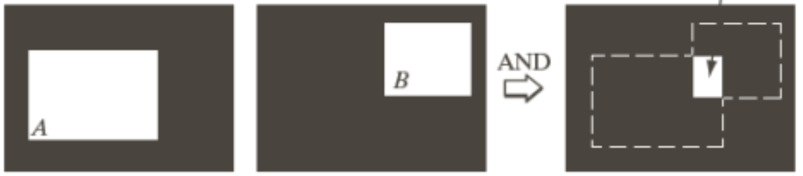

### Image Translation
- Can perform a translation by adding a translation vector $t$ to each pixel

$$
\text{Translation by vector $t$ on image $A$:}\\
A_t = \{c\ | \ c = a + t \ \text{ for all pixels}\ a \in A \}
$$

## What are Structuring Elements (SEs)?

- Structuring elements (SEs) are similar to convolution kernels: set a pixel neighbourhood, and scan it across the image
- However the outputs for SEs are binary, and the outputs are simply based on whether the kernel **‘fits’** or ‘**hits’** the image

## Image Erosion Using SEs

- Pixel value becomes $1$ if the kernel **fits** the image, and $0$ otherwise
- A fit is achieved if **all** pixels in the neighbourhood/kernel are $1$

$$
\begin{matrix}
\text{Erosion } \ominus\\\\
A \ominus B = \{x | (x+b) \in A \mathsf{\;for\;every\;}b\in B \}
\end{matrix}
$$

- Can use this to ‘erode’ an image, which gets rid of any rough edges:

- Can also be used to split ‘weakly connected’ objects in an image:

- And it can be applied iteratively to strengthen the effect:

### Using Erosion to get Image Boundary

- The resulting eroded image can then be subtracted from the original image to get the boundary, $\beta$

## Image Dilation Using SEs

- New pixel value is $1$ if the kernel **hits** the image region, otherwise 0
- A hit occurs when **any** pixel in the neighbourhood being $1$

$$
\begin{matrix}
\text{Dilation } \oplus\\\\
A \oplus B = \{x|x=a+b \mathsf{\;for\;some\;}a \in A,\;b \in B \}
\end{matrix}
$$

- Can be used to fill gaps or holes in image

- Note that this is not simply the inverse of erosion, and applying one after the other does not always get the original image

## Image Opening

- This is a type of **compound operation**: here, we apply erosion followed by dilation

$$
\begin{matrix}
\textbf{Opening } \circ \\\\
A \circ B = (A \ominus B) \oplus B
\end{matrix}
$$

- Can be used to smooth boundaries, split objects, and remove isolated pixels

- Can only be applied once; iterating this operation has no further effect
- The resulting $A \circ B$ will be a subset of $A$

## Image Closing

- Another compound operation: dilation followed by erosion

$$
\begin{matrix}
\textbf{Closing } \bullet \\\\
A \bullet B = (A \oplus B) \ominus B
\end{matrix}
$$

- Can link nearby objects and remove holes

- Can also only be performed once
- The result of $A \bullet B$ will be a subset of $A$

## Region Filling with SEs

- Fill the given image boundary with $1$ pixels
- Achieved by repeated dilation **and** intersection with inverse of the boundary

$$
\begin{matrix}
\text{Region filling} \\\\
X_k = (X_{k-1} \oplus B) \cap A^c \\
\end{matrix}
$$

## Corner Detection with SEs

- Used to identify patterns in the foreground (or background) of binary images
- Can be used for (very basic) object recognition
- The SEs used contain 0s (background), 1s (foreground), empty spaces (ignore)
- If the 1s and 0s all match, set the pixel at origin to $1$; otherwise set it to $0$
- We can combine several hit-or-miss transformations – e.g. all 4 to detect any corners

## Thinning with SEs

- Iteratively calculate hit-or-miss results, and subtract from the current image
- Repeat this until there is no further change to the image

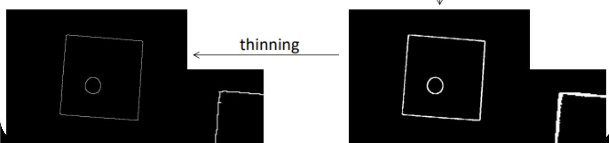

# Content-Based Image Retrieval

## Text-Based Image Retrieval

- Manually annotate images with keywords
- This lets us search through images by text with conventional database/query interfaces

### Issues with Text-Based Image Retrieval

- Descriptions of same image can vary a lot
- Cannot always describe image with words
- Impractical - too many images to describe

## Content-Based Image Retrieval (CBIR)

- Images are indexed base on features of the image
- Can search for similar images by searching for similar indices
- Various features can be used for indexing: colour, texture, shape, etc.

## Query-by-Example (QBE)

- Supply example image and get similar images back
- Index images in database, e.g. by colour histogram
- Steps:
  1. User inputs example image
  2. System calculates index of example image using chosen indexing function
  3. Images from database with similar index are returned (or histogram intersection score, etc.)

## Calculating Image Similarity

- To perform QBE, we need a way of calculating the ‘distance’ between images
- This allows the ‘closest’ (i.e. most similar) ones to be returned
- It’s common to use a distance function which outputs a value between 0 and 1 (where 0 = identical images, 1 = totally different images)
- As a basic example, we could use regular distance functions e.g. Euclidean distance along with the image histogram values

### Colour Histogram Indexing

- Colour histogram indexing works well as:
  - Simple technique
  - Good performance
  - Generally retrieves quite similar images
  - Robust to translation and rotation
  - Occlusions and noise have minimal effect
  - Main choice for many image search engines

- However, sometimes images which are obviously the same get ranked too far apart, like below:

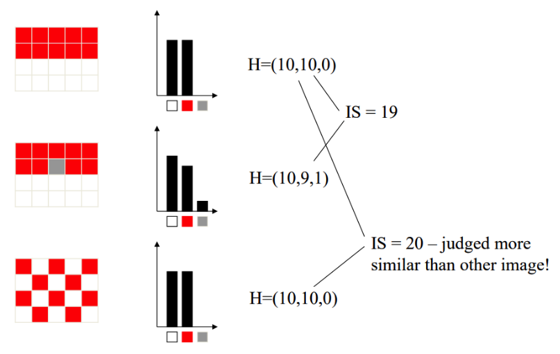

### Colour Moments

- **Colour moment** provide ‘compact’ descriptions of an image's colours
- The **1st order moment** is the mean colour value of the image, $\mu$
- The **2nd order moment** is the variance of colour values, $\sigma^2$
- These can be analysed and compared to find similar images

### Colour Coherence Vectors

- **Colour coherence vectors** take spatial information into account
- Focuses on the colour distribution in specific regions (rather than considering the image as a whole)
- Uses 2 histograms: one for uniform parts of the image, and one for textured pixels
- Measures the probabilities of colours reappearing at certain distances from each other

### Colour Correlograms

- Similar to colour coherence vectors
- Basic principle:
  1. Pick two pixels, $p_1$ and $p_2$, with distance $d$ apart
  2. What is the probability that they have the same colour?

- Good for differentiating by textures and patterns

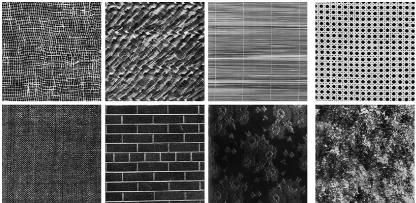

### Edge Histograms

- **Edge histograms** are used to detect shapes
- Divide the images into small (e.g. $4 \times 4$ blocks)
- Check each block for edges with edge detection kernels, e.g. Sobel filters
- Builds a histogram for indexing (or intersection comparison)

### Image Moments

- *Note: this is not the same as colour moments from above!*
- **Image moments** treat the image as 2D function, and take moments using moment equations from physics
- Can be used to describe the shapes, symmetries, etc. of an image
- The **0th order moment** is found by summing the values of all pixels – good for indexing by overall brightness
- The **1st order moment** is found by summing all pixels *multiplied by their position* – good for indexing by object position
- The **2nd order moment** is found by summing pixels multiplied by their position *squared* – good for indexing by shape
- Can also use moments to reconstruct images by using inverse moment equations

### Invariant Image Moments

- Moments change with translation, rotation, scale, and contrast changes
- But feature detection should be **independent** of these factors
- Solution: **normalised central moments**
    - Central $\to$ immune to translation
    - Normalised $\to$ immune to scale

### Combining Multiple Image Features

- Using just one feature for indexing is not usually sufficient
- We can instead make a feature vector using a combination of feature scores with different weights, e.g. colour/LBP/edge, etc.

$$
\begin{matrix}
\text{Example feature vector } \phi \\ \\
\phi = (0.5 \cdot S_{colour}) + (0.25 \cdot S_{texture}) + (0.25 \cdot S_{shape}) \\\\
\text{Where }\  S_{colour}\  \text{ is the colour intersection score, etc.}
\end{matrix}
$$

## Key Frame Extraction for Video Retrieval

- Indexing every frame in video is not feasible as …

- Neither is taking every $n^{th}$ frame as likely to miss key parts of video

- Solution: Key frame extraction

    

### Steps for Key Frame Extraction

1. Detect the scene changes in the video, e.g. using colour histogram differences
2. Select the **key frames** from the video – could be one or any mix of:
   - the first frame of the scene,
   - the ‘middle’ frame of the scene,
   - the $n^{th}$ frame of the scene (use the same $n$ for all scenes)
3. Can now use these frames with our standard image retrieval methods

## The Semantic Gap

- Computer vision algorithms don’t always 'see' what's in the image the same way humans do
- Our high-level understanding of images (feeling, aesthetic, etc.) cannot be modelled with low-level analysis tools like colour histograms
- This is known as the **semantic gap**

### Using Relevance Feedback

One way to mitigate this gap is with **relevance feedback**:

- User is presented with initial retrieval result
- User repeatedly specifies if image is relevant or not, and model adjusts its weights according
- Repeat until model is accurate enough
- (Similar to neural network training)

## Region-Based Image Classification

- It’s sometimes useful to classify images by their general contents – e.g. indoors, outdoors, 3D render, nature, photograph, sports, etc.
- This requires a **region-based** approach
- Then we can associate each region of the image with words
- One way to do this is with statistical modelling, i.e. get a probability model for each region of the image

## Region Trees (R-Trees)

- When comparing images, the image features are stored in a *feature vector* – this vector could have 10s or 100s of dimensions, one for each feature’s score
- The closest matches to query can then be found using a chosen distance function
- Searching all images to find the closest ones would take too long, so we use **R-trees** to save time

### Steps for R-Trees

==TODO==

1. Organise the data in a tree structure
2. Each leaf node of the tree pertains to an image

- Organise data in tree fashion so search only performed on relevant part of database
- Data items stored in leaf nodes of tree
- Search space divided (e.g. into  __n-__ dimensional hypercubes)
- Intermediate nodes store the bounding boxes and pointers to child nodes
    - Too many child nodes in bounding box $\to$ split box in two
- $M$ = max. num of child nodes, $m$ = min. number of child nodes
- Adding leaf node:
    - Find region for leaf node
    - If $M$ leaf nodes already in region, split region in two with size $m$
    - Check whether split affects any of the nodes further up the tree
        - Create/split regions as necessary
- R-tree examples in slides

# Database Visualisation

## Database Navigation and Browsing

### Why Visualise Image Databases?

- Good way of managing large image collections
- Gives user a visual overview of the database and its contents
- Can interact with the database to browse through images
- Doesn’t require example images or queries
- Gets around semantic gap issues by passing the processing back to the human – the user searches for what they want, rather than getting the computer to do it for them

### Visualisation vs. Navigation

Database image browsers have 2 main tasks:

1. **Visualisation**: Arrange images in a way that makes sense and is easy to browse – but this is not useful by itself
2. **Navigation**: Allow the user to interact and browse the database, using the chosen visualisation method – this must be **interactive** and **intuitive** for the user

### Problems With Regular Image Browsers

- Standard image browsers (e.g. Windows File Explorer) are not designed for large image databases
- They can sort by date or name, but not by image features
- Browsing large databases is difficult with their layout

### Problems with Content-Based Image Retrieval

- Requires a good query to work (e.g. a good example image, or the right keywords)
- System might not understand what part of the image you’re looking for
- The search system is often a black box, i.e. no way to know exactly how it’s working
- Sometimes the most suitable images get missed with this method
- Query by keywords is another popular method of database searching, but also has issues
  - Requires the whole database to be annotated
  - If done manually, will take a *loooong* time to label all images accurately
  - If done automatically, risk system not annotating images properly

The solution to these issues is to use **database navigation** instead of CBIR.

## Method 1: Mapping-Based Visualisation

- A well-established method for visualising image databases
- This method involves mapping the images onto a 2D or 3D grid with similar images placed close together

### Dealing with Image Overlap

- Plotting images near each other can lead to images overlapping and hiding each other
- Can solve this by spacing the images out and moving them to fill empty spaces on the grid
- Fill any empty cells on the grid
- Move items across from neighbouring cells
- =='place - bump - double bump'==

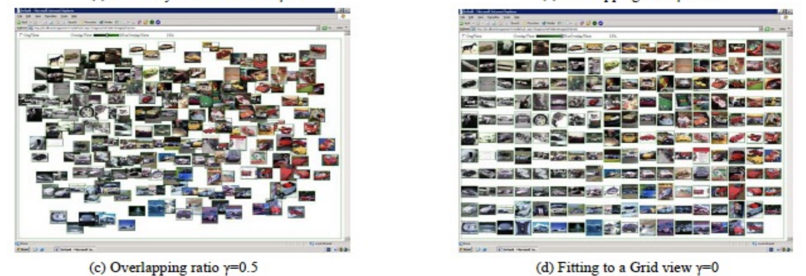

### Dimensionality Reduction

- Recall that image feature vectors usually have 10s or 100s of dimensions
- So for mapping-based visualisation, we need to find a way to ‘convert’ the feature vectors to 2D, e.g. by finding the two most distinctive features
- This is called **dimensionality reduction** or **data decorrelation**, and the most commonly used methods are **PCA** or **MDS**, explored later.

## Principal Component Analysis (PCA)

One way to reduce the components of a vector is through principal component analysis:

- PCA reduces the dimensions of a vector by identifying the **‘principal components’ (PCs)**, i.e. the most ‘important’ axes of the feature vectors
- It takes the vectors with the most variance and weighs these higher, as they …

- From this we can make a **projection matrix**, $P$, which will convert the high-dimensional feature vectors to lower-dimensional feature vectors
- The new feature vectors should still have a good amount of variance, and help distinguish images despite the lower dimensions

$$
\text{Basic example of PCA}\\
\text{Transforming a 3D vector into 2D}\\\\
P\begin{bmatrix}X\\Y\\Z\end{bmatrix}
=
\begin{bmatrix}2X+Y\\3Z -\frac{1}{5}Y\end{bmatrix}\\\\
\text{$P$ is the projection matrix found through PCA.}\\
\text{X and Z are the most relevant components of the original}\\
\text{vector, so they are weighted more in the projection.}
$$

- For mapping-based visualisation, this usually involves converting feature vectors with 10s or 100s of axes down to just 2 or 3 (so they can be mapped onto a 2D/3D grid to show the user)
- The original data can be recovered using the inverse of the transformation matrix
- The concept of PCA is somewhat similar how an autoencoder works in machine learning

### Steps for PCA

- PCA involves taking the entire database of feature vectors at once, represented as a single $n \times d$ matrix where $n$ is the number of images and $d$ is the dimension of the feature vectors
- To find the transformation matrix for PCA ($P$ in the example above), we must do the following:
  1. From the full $n \times d$ dataset of feature vectors, calculate the **covariance matrix**, $A$
  1. Compute the **eigenvectors** of $A$ and sort the eigenvectors by their corresponding **eigenvalues**
  1. Take the top $k$ eigenvectors with the largest eigenvalues – these eigenvectors are the **principal components**, and the eigenvectors together form the transformation matrix $P$
  1. Can now multiply $P$ by the original data matrix to get the new lower-dimension feature vectors

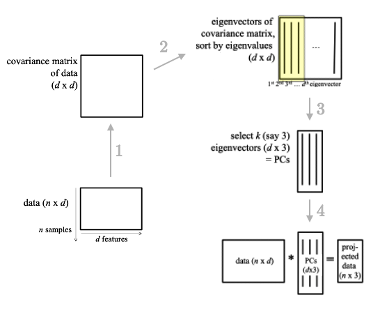

### PCA for Image Database Visualisation

As mentioned, PCA can be used for mapping-based image visualisation:

1. Use PCA to get new image feature vectors
2. Take first 2 or 3 PCs to define the database visualisation space
3. Plot each image onto the visualisation space (in 2D or 3D) – typically this means putting the thumbnail of each image in its new PCA-based location

### PCA for Face Recognition

PCA can also be used to compare the similarity of facial images, and detect if two faces are the same:

1. Get big feature vectors from faces
1. pick top $k$ PCs = 'eigenfaces'
1. faces get represented by co-ordinates/weights in new space
1. face recognition by finding closest face in new space (e.g. euclidean distance)

## Multi-Dimensional Scaling (MDS)

- Another way to project feature vectors to a lower dimensional space
- Uses ‘pair-wise’ distances to convert to 2D/3D while maintaining the original feature distances as much as possible
- Allows for more accurate representation as inherently based on distances and similarities
- Doesn’t use feature vectors
- Typically slower than PCA
- Required initial config through PCA?? (so what’s the point in MDS)
- Iteratively changes config to better fit the data
- ‘Stress’ function

==TODO: tidy/redo this==

### Steps for MDS

==TODO==

1. obtain distances (e.g. from feature vectors)
2. decide new dimensionality (usually 2)
3. generate initial configuration
4. perform MDS
5. plot image thumbnails at new calculated co-ords
    ⇒ similar images get projected to similar locations

## Method 2: Clustering-Based Visualisation

- Group images with similar features into clusters (groups)
- Rather than using feature vectors, the clusters may be based on the image’s **content, metadata, creation date**, etc.

## K-Means Clustering

### Steps for K-Means Clustering

The most common process for clustering images for visualisation is known as **k-means clustering** – the basic steps are as follows:

1. Place images on a feature grid 
2. Choose $k$ random points to be the starting cluster centres
3. Move each sample to its closest cluster centre
4. Calculate new cluster centres using the image’s *original* positions
5. After repeating steps 3-4, the cluster centres will converge and stop moving
6. Can now group/cluster the images using the final cluster centres

### K-Means Clustering for Image Segmentation

The process for k-means clustering can be applied for image segmentation, e.g. separating the foreground and background of images:

1. Decide how many clusters we need (might take trial and error)
2. Run the algorithm using each pixel as a sample, and their RGB values to calculate the distances between them

### K-Means Clustering for Colour Quantisation

**Colour quantisation** involves reducing the number of colours used in an image while best preserving the contents – useful for e.g. image compression or printing with a limited number of colours:

1. Choose $k$ cluster centres, i.e. the final number of colours
2. Run the algorithm using each pixel’s RGB values (or grayscale)
3. The new cluster centres form the final colours, and each colour can be mapped to its closest cluster centre

### K-Means Clustering for Image Browsing

K-means clustering can of course also be used for image browsing:

1. Extract features from images as usual
2. Run the algorithm using the feature vectors to calculate distances
3. Map the images on a new grid with a representative image for each cluster (e.g. the image closest to the middle, to represent the whole group)
4. The user can ‘open’ this cluster/folder to show similar images

## Method 3: Hierarchical Image Browsing

- We can expand on the idea of using representative images for groups by creating a **tree** of images
- Going down the tree shows more specific/nuanced difference between the images
- Basic example using image date: years $\to$ months $\to$ days $\to$ time of day etc.

### Steps for Hierarchical Image Browsing

To make the tree for hierarchical image browsing, we do the following:

1. iteratively merge the two most similar clusters to form a new cluster
2. stop when only 1 cluster remains
3. keep the old clusters even after merging $\to$ this forms the merge tree

## Method 4: Graph-Based Visualisations

- Similar to hierarchical image browsing

- Arrange the images into a graph structure where each node is an image of the database

- The edges of the graph connect the similarity of the images based on annotations, contents, etc.

- Can then be visualised using a **‘mass-spring model’**

## Visualisation Methods

Once images have been mapped or grouped using one of the above methods, it can be visualised with one of the following methods:

### Horizontal Image Browsing

- A single screen of visualised images
- Images are in a 2D plane with panning and zooming functionality
- Hovering over image magnifies the image
- Useful for:
  - When image database has been visualised with mapping or graph scheme
  - Viewing a single cluster/group of similar images

### Vertical Image Browsing

- works with hierarchical visualisation
- clusters of images visualised with representative image
- selecting an image 'zooms' into that cluster
- ‘vertical’ because ==…==

### Graph-Based Browsing

- uses panning and zooming to aid navigation/visualisation
- can also select edges to navigate

### Time-based browsing

- use time stamp associated with image to arrange images, often clustering based as well
- e.g. the photos app on iOS: can zoom out to show years, zoom in to show months/days etc.

### Hue-Sphere Browsing

- extract median colour of each image to get hue and lightness values
- plot to globe using e.g. hue and lightness as coordinates
- can tilt and pan sphere to view different sections, can zoom
- can also do **‘hierarchical hue sphere’** where zooming in gives more precise hue/lightness values
- Can use with a VR headset for 'immersive' hue sphere browsing

# Colour Constancy & Invariance

## What is Colour Constancy?

- The concept of perceiving the ‘actual’ colours of an object despite suboptimal lighting conditions; human eyes do this very well as they can easily adapt
- In computer vision this involves estimating the image’s original lighting conditions, then shifting the colours to look like it had normal lighting
- Used for basic colour correction, e.g. changing white balance and/or brightness
- Typical example would be a photo taken with yellow lighting, and shifting it to look like it was taken under white lighting
- Makes images mostly invariant to brightness, illumination colour, and differing camera sensors

## Color Formation

-  Colour can be calculated from surface geometry $\times$ surface material $\times$ incoming light $\times$ device sensor

## Colour-Based Image Retrieval

- Calculate colour histograms
- Use histogram as image index
- Query by example (QBE) - retrieve similar images by colour content
- show top ranking results according to intersection (similarity) score
- **Pros**: Good performance, simple technique, invariant to translation/rotation, robust to occlusions
- **Cons**: requires image capture to be controlled as it is NOT invariant to capturing conditions - illumination, weather, camera sensor
- The illuminant (i.e. light) can change the colour dramatically

## Chromaticity Space

- Colour scheme based on **chromaticity**, i.e. the colour information while ignoring the intensity/brightness

$$
\begin{bmatrix}R\\G\\B\end{bmatrix}
\to
\begin{bmatrix}
R\;/\:(R+G+B)\\
G\;/\:(R+G+B)\\
B\;/\:(R+G+B)
\end{bmatrix}
$$

- Invariant to intensity, brightness changes, shading etc.

## Modelling Illumination Change

- A basic model is to represent illumination changes as a **linear transformation**, $T$:

$$
T = \begin{bmatrix}R_1&G_1&B_1\\R_2&G_2&B_2\\R_3&G_3&B_3\end{bmatrix}
$$

- $T$ can then be applied to get colour shifted image: $I_2 = I_1 \cdot T$
- Can be further simplified to a **diagonal model**:

$$
T = \begin{bmatrix}R_1&0&0\\0&G_2&0\\0&0&B_3\end{bmatrix}
$$

## Changing White Balance

- Colour constancy is usually about correcting images for white balance
- Illuminant light represented as RGB value, i.e. $E = [E_R,\:E_G,\:E_B]^T$

- Can’t recover the brightness of illuminant, so assume consistent brightness for all illuminants and scale the vectors to 1 unit length
- Can use the values of $E$ to correct for white balance:

$$
\begin{matrix}
\begin{bmatrix}
R_{corr}\\
B_{corr}\\
C_{corr}\\
\end{bmatrix}
=
\begin{bmatrix}
\frac{W_R}{E_R}\cdot R\\
\frac{W_G}{E_G}\cdot G\\
\frac{W_B}{E_B}\cdot B\\
\end{bmatrix}\\\\
\small
\text{Where } W \text{ is the illumination of pure white light}
\end{matrix}
$$

- There are two main approaches for colour constancy: **statistical** algorithms, and **physics-based** algorithms

## Statistical Algorithms for Colour Constancy

- Colour correct by calculating stats of image, and using statistical knowledge of lights and surfaces
- Algorithm is only suitable if there are multiple surface types in image
- Requires wide range of colours in image to be effective

### Greyworld

- Assume that a corrected image has a mean RGB value of grey, $(128,\:128,\:128)$
- Use the mean RGB of the uncorrected image to estimate the illuminant:

$$
E = \left ( R_{\text{avg}},\:G_{\text{avg}},\:B_{\text{avg}} \right)
$$

### MaxRGB

- also known as ‘White Patch Retinex’
- assumes that the brightest patch of the scene should be pure white, $(255,\:255,\:255)$
- So the brightest patch found in the uncorrected image (the ‘max RGB’) will give the estimate for the illumination:

$$
E = \left ( R_{\text{max}},\:G_{\text{max}},\:B_{\text{max}} \right )
$$

### Shades of Grey

- Mix of Greyworld and MaxRGB
- There is a function called the **Minkowski norm**:

$$
\text{Minkowski norm:}\ \
\left( \sum^{N}_{i=1}|x_i-y_i|^p \right) ^{\small{\dfrac{1}{p}}}
$$

- Greyworld can be rewritten in the same form with $p=1$; MaxRGB can also be written similarly by setting $p=\infty$
- The **Shades of Grey** method uses any $p$ value between $1$ and $\infty$ (usually 6) to ‘compromise’ on Greyworld and MaxRGB algorithms

## Physics-Based Algorithms for Colour Constancy

- Uses understanding of physics, e.g. shadows, materials, reflections
- Can give solution even with limited colour range and surface types 

### Dichromatic Reflection Model

- Reflected light from object has two components: the **body reflection** and the **interface reflection**
- Both reflection types are dependent on the colour of the surface as well as a given ‘geometry scale factor’

### Body Reflectance

- Body reflectance is proportional to illuminant $\times$ surface
- Light enters the surface and gets reflected as determined by the **colorant particles** in the surface material
- Body reflectance is also sometimes called ‘matte’ or ‘Lambertian’ reflectance

### Interface Reflectance

- Interface reflectance is equal to the illuminant reflectance

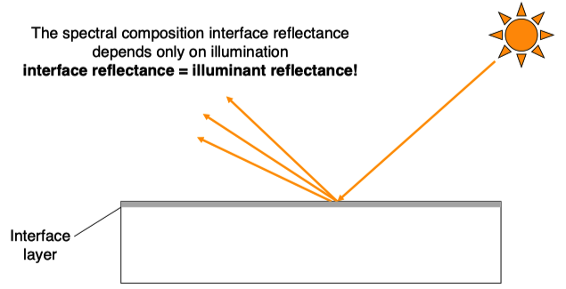

### RGB Response of Dichromatic Surfaces

- Dichromatic surfaces reflect both body and interface reflectance
- The RGB response of the surface will be some mix of the body reflectance and interface reflectance

$$
(R,G,B)_{reflected} \\ 
= \alpha \cdot (R,G,B)_{body}\ +\ \beta\cdot (R,G,B)_{interface} \\
= \alpha \cdot (R,G,B)_{body}\ +\ \beta\cdot (R,G,B)_{illuminant}
$$

- If we have the RGB values from multiple surfaces, we can solve simultaneous equations (i.e. find intersection) to get the original illuminant’s RGB!

### Planckian Locus Constraint

- Most illuminants follow a rough pattern known as the ‘Planckian locus’ 
- So if only one surface present, can use the locus as a constrain to solve for the illuminant

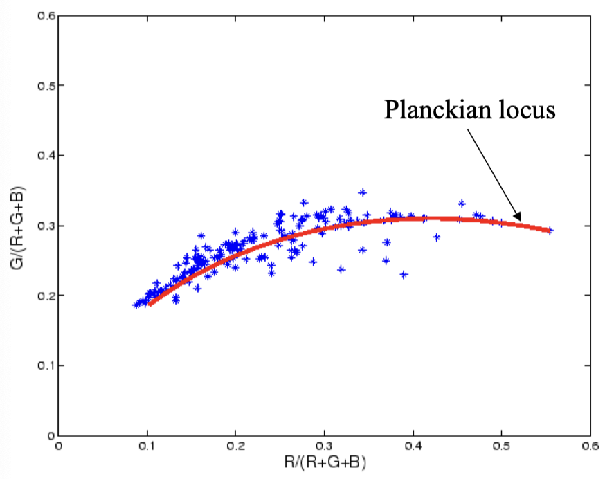

### Illuminant Gamut Constraints

- Sometimes the Planckian locus is not appropriate, i.e. if the light is too far ‘off-locus’
- In this case, can use the whole gamut of commonly used illuminants as the constraint

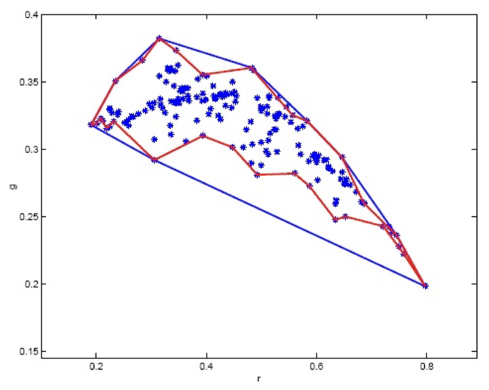

## Invariants & Normalisation

- Techniques to standardise images, specifically for image analysis or retrieval – not concerned with making image look good for humans like constancy does
- Simpler than colour constancy, as doesn’t require knowledge/estimation of illumination to apply

### Colour Normalisation

- Getting two images to have similar contents regardless of lighting conditions

- The ratio of RGB values to each other remains constant through illumination changes
  - i.e. $\dfrac{\alpha R_i}{\alpha R_j} = \dfrac{R_i}{R_j}$
- So Greyworld and MaxRGB normalisation give **‘illumination invariant descriptors’** of the image
- **Histogram equalisation** can also be used to achieve colour invariance by applying it to each RGB channel individually
- Can also use convolutions to get colour ratios in relation to surrounding pixels

### Comprehensive Normalisation

- **Chromaticities** are invariant to image geometry $(R \to \dfrac{R}{R+G+B})$, and
- **Greyworld normalisation** provides illumination invariance. So…

- **Comprehensive normalisation** involves performing both chromaticity normalisation and greyworld normalisation together, to get a version of the image invariant to geometry **and** illumination!

### Gamma & Linear Images

- Images are formed with linear equations from physics
- In reality images are not linear, and linear images look bad to us
- So we apply gamma to our displays to make images look more normal
- Visible contrast ratio is ~10000:1 (e.g. bright sun vs pitch black)
- Displays have contrast ratios of ~100:1
- So contrast ratio is 'compressed' – gamma is a way to 'uncompress' it

- Gamma ($\gamma$) is applied to all pixels on the display with $R \to R^{1/\gamma}$

- Lower gamma e.g. $\gamma < 1$ brings out details in shadows, whereas
- Higher gamma e.g. $\gamma > 1$ shows details in highlights/bright areas

### Brightness

Brightness change is applied as a simple linear change to each subpixel of the image, i.e. $R \to \alpha R$ where $\alpha$ is the brightness change

### Invariance to Brightness & Gamma

Can use a specific hue descriptor which is invariant to contrast, gamma and brightness:
$$
\text{tan}^{-1}\dfrac{\text{ln}\:R-\text{ln}\:G}{\text{ln}\:R+\text{ln}\:G-2(\text{ln}\:B)}
$$

# Texture

## About Texture

- Textures are easy to recognise as humans, but hard to define for computers
- Image texture is related to pixels in relation to their neighbourhood
- It can be defined as the variation in intensity between pixels in a given region of an image

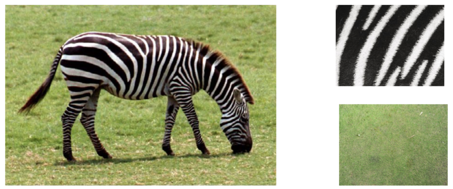

## Applications of Texture Analysis

- Can be used for **image segmentation**, e.g:
  - Background/foreground separation – foreground objects will have a different texture
  - Or skin lesion detection – skin lesions look different from the rest of the skin

- Can be used for **cell identification**, as different human cells have different textures:

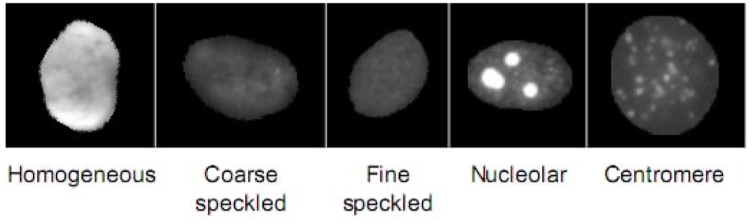

- Can even be used to generate new images from saved textures

## What are Texels?

- A texture is a pattern of **repeated elements** – some repetition in the intensity and relative positions of the pixels
- The repeated elements are known as **‘texels’** (or **texture primitives**)

### How Texels Vary

Texels vary depending on the texture it describes; the texels can vary by:

- **Speed**: texels can vary **rapidly** (close patterns) or **slowly** (larger patterns)
- **Direction**: texels can vary with a high or low degree of directionality (==…==)
- **Regularity**: texels can be **periodic** (i.e. *regular*, like a piece of cloth) or **stochastic** (i.e. *random*, like clouds)

## Statistical Approaches

- A simple statistical approach is to use **statistical moments** of the image’s colour histogram
- Considers the **distribution** of intensities across the whole image (or given region)
- Can then categorise textures as ‘smooth’, ‘rough’, ‘grainy’, etc.

### Moments for Texture Descriptions

- Let $p(z_i)$ be the probability that the intensity level $i$ appears in the image $z$, so $p(z_i), i = 1, 2, \dots 255$ would be the full image histogram
- The **1st order moment** is the **mean** ($m$) of the histogram
- The **2nd order moment** ($\mu_2$) is equal to the **variance** ($\sigma^2$) of the histogram, and represents the **contrast** of the image
- The **3rd order moment** ($\mu _3$) of the histogram represents the **skewness** of the image, i.e. how skewed it is to a side vs. being evenly distributed

### Smoothness, Uniformity and Entropy

- An image’s **uniformity** ($U$, sometimes called **energy**) can be calculated using the histogram, where $U(z) = 1$ would be a completely uniform image

- An image’s **entropy** ($e$) represents the randomness of the image, where higher values are more random

- An image’s **smoothness** ($R$) can be calculated using the 2nd order moment; $R(z)=0$ would imply a constant intensity (completely smooth)

### Comparing Statistical Descriptors

- We can build descriptors of different textures using their mean, variance, skewness, smoothness, energy and entropy

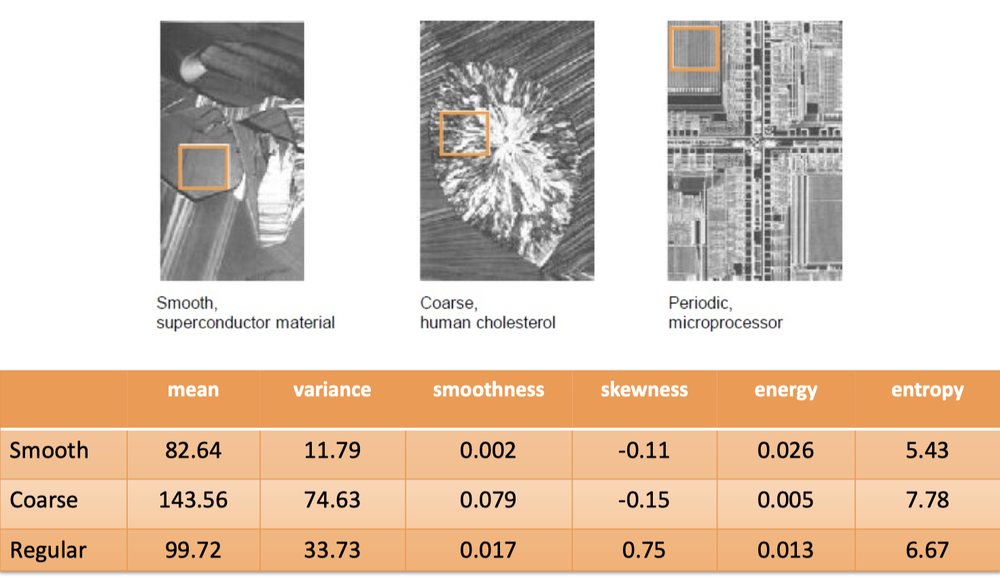

### Issues With Statistical Descriptors

- Segmentation using statistical descriptors doesn’t work too well
- Histograms don’t provide any detail on pixels in relation to each other, which is sometimes important for texture analysis

## Co-Occurrence Matrices

- More difficult to calculate than statistical descriptors, but performs better
- Considers not just the distribution of intensities, but the **relative positions** of pixels
- Choose a pixel relationship for comparisons – for example, ‘every direct right neighbour’
- The co-occurrence matrix is $255\times 255$ in size, and each element $g_{ij}$ represents the frequency of occurrences where:
  - the first pixel had intensity $i$,
  - its ‘related’ pixel (e.g. directly to the right) had intensity $j$

### Co-Occurrence Matrix Features

Various features of the co-occurrence matrix can be calculated:

- The **maximum probability** of the matrix reveals the strongest responding part of the matrix
- The **correlation** can be calculated to see how correlated pixels are with their chosen neighbours
- The **energy** measures the uniformity of the matrix
- The **contrast** of the matrix
- The **homogeneity** measures how fair the elements are from the diagonal (==??==)
- The **entropy** reveals the randomness of the matrix values

## Edge-Based Texture Descriptors

- We can describe texture features using the information from edge detectors (e.g. sobel edge detection)
- Can calculate the frequencies and directions of edges, and use these to describe texture features

## Laws’ Texture Masks

- Uses image filters to analyse textures
- Find the right filter kernels to return texture information from the image

### Starting Filters

Starts with 3 simple $1\times 3$ filters:

- **Averaging filter**, $L_3$: [1  2  1]
- **Edge filter**, $E_3$: [-1  0  1] (1st order derivative)
- **Spot filter**, $S_3$: [-1  2  -1] (2nd order derivative)

### Combining Filters

- Can apply filters to themselves like convolutions to get more complex $1 \times 5$ filters:

- And by transposing one of the filters, we can combine them to get 2D texture masks:

- These texture masks can then be applied to images to create texture descriptors for them

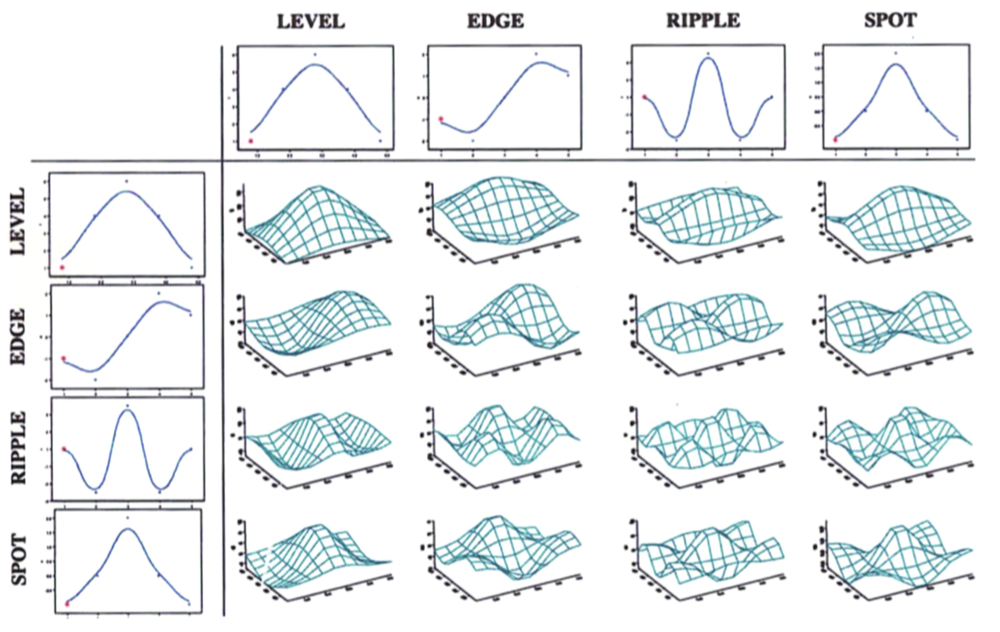

- These are typically used along with the image’s **energy** values from earlier to provide a more comprehensive description of the image’s texture

## Local Binary Patterns (LBPs)

- Another simple but powerful texture descriptor
- Describes the relationship of a pixel with its 8 direct neighbours
- Encodes the result into a binary pattern
- The resulting information can then be summarised into a histogram by ==…==

### Calculating LBPs

1. Start with a $3 \times 3$ matrix of intensity values

$$
\begin{bmatrix}
g_1&g_2&g_3\\
g_4&g_c&g_5\\
g_6&g_7&g_8
\end{bmatrix}
\;\;\;\;\;e.g.
\begin{bmatrix}
125&75&83\\
87&81&72\\
51&142&189
\end{bmatrix}
$$

2. The binary pattern is calculated by comparing each element with the centre value: if $g_i \geq g_c$, that cell becomes $1$, otherwise $0$

$$
\begin{bmatrix}
125&75&83\\
87&81&72\\
51&142&189
\end{bmatrix}
\to
\begin{bmatrix}
1&0&1\\
1& &0\\
0&1&1
\end{bmatrix}
$$

3. Then multiply each value of the resulting matrix by the values given here:

$$
\begin{bmatrix}
2^4&2^3&2^2\\
2^5& &2^1\\
2^6&2^7&2^0
\end{bmatrix}
$$

4. And sum the values of the final matrix to get the LBP, like so:

$$
\begin{matrix}

\begin{bmatrix}
1&0&1\\
1& &0\\
0&1&1
\end{bmatrix}
\;\; .* \;
\begin{bmatrix}
2^4&2^3&2^2\\
2^5& &2^1\\
2^6&2^7&2^0
\end{bmatrix}
\; =\;
\begin{bmatrix}
2^4&0&2^2\\
2^5& &0\\
0&2^7&2^0
\end{bmatrix}
\\
\\
2^0 + 2^2 + 2^4 + 2^5 + 2^7 = 1 + 4 + 16 + 32 + 128 = 181

\end{matrix}
$$

## LBP Improvements

### Circular LBPs

- The corner neighbours are slightly further away than the side neighbours, making the descriptor slightly less reliable
- Solution: can implement a ‘circular neighbourhood’
- Use interpolation to get the pixel values for the new ‘corners’

### Making LBPs Invariant to Rotation

- If the texture gets rotated, binary pattern will be rotated as well
- We want a descriptor that it not affected by rotation
- Solution: take the **lowest possible** LBP from all possible rotations
- This is the ‘rotation invariant’ LBP

### Uniform LBPs

- Only record uniformity measures
- ==TODO==

### Multi-Scale LBPs

- Texture patterns might occur at varying scales
- Can vary the radius of the circular LBPs to get texture descriptors for different scales

### Multi-Dimensional LBPs

- ==TODO==

# Image Compression

## Why do we Need Image Compression?

- Image files can be really, really big ($width \times height \times bitdepth \times channels$)
- So uncompressed images take a lot of resources to manage: storage, RAM, processing power, etc.
- There are also much more efficient ways to store an image than listing all individual intensity values – this is where image compression comes in

## Lossless vs Lossy Image Compression

- **Lossless** compression *doesn’t* remove any data – if we compress and decompress an image this way, we will get the exact original image back
- **Lossy** compression removes data to compress the image even more – we  can’t recover the original image from an image compressed this way, although the quality difference is usually quite small
- Lossy is often used to reduce file sizes even more, but lossless is used when the original quality needs to be preserved

## Basic Data Compression Techniques

- For this section we will use $Z$ as an example sequence of numbers, taken from the top row of an image:

$$
Z = \begin{bmatrix}212&211&211&215&214&214&214&214\end{bmatrix}
$$

### Runlength Coding

- With **runlength coding**, we simply specify each number and how many times it repeats:

$$
Z_R = 
\begin{bmatrix}
1 ,212&2 ,211&1 ,215&4 ,214
\end{bmatrix}
$$

- This works for images as they often have patches of repeated pixels

### Differential Coding

- With **differential coding**, we store the difference of each pixel relative to its previous value:

$$
Z_D = \begin{bmatrix}212&-1&0&4&0&0&0\end{bmatrix}
$$

- This actually requires more storage as the range is now $-255 \to 255$ per cell, rather than $0 \to 255$ like before
- But the values are often quite small, which we can take advantage of with **entropy coding**

### Entropy Coding & Huffman Coding

- **Huffman coding** (one example of entropy coding) takes advantage of the fact that intensity values occur with different probabilities in an image
- A **‘Huffman table’** is made, mapping the different values to binary codes based on their frequency
- The most common values get given the shortest binary codes, and the uncommon values are given the longer binary codes
- For $Z$, the best Huffman table would be:

$$
\begin{matrix}
\begin{aligned}
214 & \to 0 \\
211 & \to 10 \\
212 & \to 110 \\
215 & \to 111
\end{aligned}\\
\\
Z_H = \begin{bmatrix}110&10&10&111&0&0&0&0\end{bmatrix}
\end{matrix}
$$

- This reduces the storage size considerably, and the table can be used to get the original values back

- To make a Huffman table:

  1. Sort the values by their frequency

  1. ==…==

- However, we can usually use pre-made Huffman tables made to work with a range of images – this is how **JPEG compression** works

## PNG Compression

- PNG uses **‘predictive coding’** to compress image losslessly
- A **prediction** is made of each pixel’s value, based on its direct top and left neighbours
- The difference between the prediction and the actual value is then recorded
- This is just an extension to **differential coding** from earlier – the ‘predictor’ was the immediate left neighbour, and the difference between that and the true value was recorded

### PNG Predictors

Whereas differential coding always uses the direct left neighbour as its predictor, PNG can use any of 5 different predictors:

- **Type 1** aka **‘Sub’**: The direct **left** neighbour’s value
- **Type 2** aka **‘Up’**: The direct **top** neighbour’s value
- **Type 3** aka **‘Average’**: The mean average of the left and top neighbours
- **Type 4** aka **‘Paeth’**: Let $A$, $B$ and $C$ be the left, top-left and top neighbours respectively; pick whichever value out of $A$, $B$ and $C$ is closest to $p = A + B - C$
- **Type 0** aka **‘None’**: Just $0$

### PNG Data Structure

- An image after PNG compression is list of pairs with the number of the predictor type, and the difference to the predicted value:

$$
Z_P = \begin{bmatrix}
0,212&
1,-1&
1,0&
1,4&
\cdots
\ 
\end{bmatrix}
$$

- This is then compressed further with the **‘DEFLATE’** algorithm
- The DEFLATE algorithm uses the entropy coding from earlier, as well as **duplicate string elimination**
- If two pixels have the same value, the 2nd pixel is replaced with a reference to the 1st pixel’s location, so the value doesn’t need to be stored again

## JPEG Compression

- The most popular compression algorithm used today
- Exploits the fact human eyes cannot notice small changes in colour
- Basic steps:
  1. Compress the **colour space**
  2. Compress the **frequency domain**
  3. **Quantisation** – the lossy part
  4. Finish with entropy coding

### Colour Space Conversion

- Convert pixel values from $[R,G,B]$ to $[Y, C_b, C_r]$ where $Y$ is the intensity, $C_b$ is the yellow-blue scale, and $C_r$ is the red-green scale
- This way can compress colour data more aggressively than brightness (as brightness differences are more noticeable)

### Frequency Domain Compression

- Images are typically stored in the **spatial domain**, i.e. storing each pixel’s values in a spatial ‘grid’
- We can instead store images using the **frequency domain**, which describes images in terms of its intensity patterns and frequencies
- Human eyes notice changes in the low-frequency intensities, but tend not to notice changes to the high-frequency information
- As such, we can heavily compress the high frequency information without noticeably impacting the image quality
- Frequency domain compression is **lossless**

### Discrete Cosine Transformation (DCT)

- **Discrete cosine transformation (DCT)** is one method to convert images to the frequency domain
- JPEG splits the image into ‘blocks’ of $8 \times 8$ pixels, and DCT is applied to each section separately
- The image is compared to 64 different **frequency bands** (or ‘basis functions’):

- The idea is to describe the image as a given combination of these frequency bands; the result will be another $8\times 8$ matrix where each value represents the amplitude of the corresponding frequency band
- For example, if using DCT on an image with one solid colour, only the top-left value of the resulting matrix will have a value $>0$ as it is the only ‘pattern’ present in the image
- This process is applied separately to each $[Y, C_b, C_r]$ component of the image

### Quantisation

- **Quantisation** is the process of reducing a large range of values to a smaller range
- Can be represented as a function $y = \text{round}(V/q)$ where $V$ is original pixel intensity and $q$ is the ‘quantisation factor’
- The quantised value can then be multiplied by $q$ to get a value close-ish to the original
- The rounding in quantisation removes some information, hence quantisation is **lossy**
- The quantisation value $q$ can be chosen when compressing, giving the user control over image quality vs. file size
- JPEG quantises luminance and chrominance separately

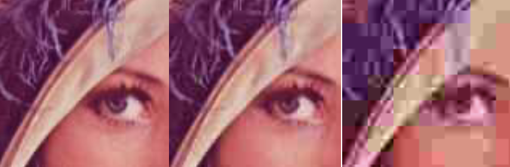

### DC vs. AC Entropy Coding

- Recall that DCT returns both direct current (DC) and alternating current (AC) values/codes
- The DC and AC codes can be stored and encoded separately
- The DC values are encoded using **Huffman coding** from earlier, using a Huffman table supplied by the JPEG standard
- The AC values are encoded in order using a zig-zag pattern, such that lower values appear in the lower-right:

- This ensures that there are long runs of 0s (especially after quantisation where most values close to 0 will become 0)
- This means it can be efficiently encoded with runlength encoding!

### JPEG Decompression

Recall the overall process for JPEG compression is as follows:

1. Compress the **colour space**
2. Compress the **frequency domain**
3. **Quantisation** – the lossy part
4. Finish with entropy coding

Decompression involves essentially the same steps, but in reverse:

1. **Decode** the entropy data
2. **De-quantise** the DCT values
3. Use **inverse DCT** to convert back to the spatial domain
4. **Upsample** back to the **original colour space**

## Using CBIR With Compressed Images

- Most CBIR techniques only work with uncompressed images, but the amount of images means compression is a necessity
- One solution:
  1. Obtain the feature vectors from the decompressed image
  2. Then compress it and store it along with its feature vector
- Ideally, we want a CBIR method that works directly with compressed images, i.e. **midstream content access**

### Midstream Content Access

Options for midstream content access are:

- **Compressed-domain CBIR**: Operates directly on DCT coefficients (but still need to reverse the encoding and quantisation)
- **Texture descriptors from AC coefficients** can be used, as the AC values represent the variance of pixels in the image blocks
- **Edge descriptors** can be retrieved and used from the AC values in the same way
